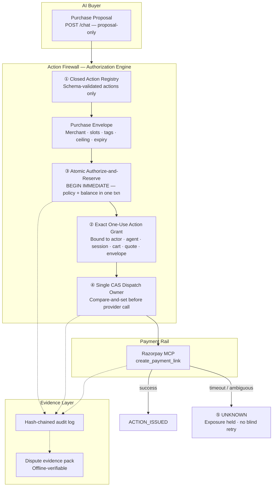

<div align="center">

# Action Firewall — AI Commerce Permissions

**[▸ Live demo](https://resplendent-kindness-production-4c97.up.railway.app/)**

**Razorpay AI Buildathon — Track 01: AI Growth & Agentic Commerce**

> A store that can safely say yes to an AI buyer — and prove to someone who does not trust it that saying yes was correct.

Documentation & Pitch: [docs/pitch-deck.html](docs/pitch-deck.html) · Runs locally in three commands ([§7](#7-run-it-three-commands-from-clean-clone))

[Quickstart](#7-run-it-three-commands-from-clean-clone) ·
[Architecture](#4-architecture-five-structural-guarantees) ·
[Benchmarks](#3-verified-benchmarks) ·
[Features](#main-features) ·
[Honest Limits](#6-what-this-is-not-honest-limits) ·
[What Broke](#8-three-times-this-repository-was-wrong)

</div>

---

## Why Action Firewall stands apart

**1 · Every AI purchase becomes independently verifiable.**
Every attempt creates an evidence pack containing the approved rule, the exact words the customer saw, the server-priced quote, catalog facts, and stock reading. [`verify_dispute_pack.py`](backend/scripts/verify_dispute_pack.py) re-runs the authorisation from those inputs—using **no database, no signing key, and no network**—then compares its result with the recorded decision. This gives merchants and acquirers a portable, checkable answer for every contested action.

**2 · Consent is compiled into precise, enforceable authority.**
A shopper's goal becomes an explicit Purchase Envelope: slots, tags, merchant, ceiling, and expiry. The human-readable approval is generated by a **pure function of that envelope**, then hashed before authority is activated. Anyone can recompute the exact consent language from the same rule; after activation, execution is governed by that bounded authority rather than a fresh model interpretation.

**3 · Shoppers see the real scope of permission before they approve.**
The Envelope readback turns a seemingly simple rule into an understandable decision. "One item tagged `cheese`" currently admits **3 items, ₹135–₹899, with Parmigiano Reggiano as the dearest**. It also shows that the permitted basket is ₹527, so the ₹7,840 ceiling is not doing the protective work—the semantic rule is. [§3.2](#32-policy-compliance-and-recovery-1100-cases) demonstrates why that distinction matters.

**4 · The proof stays current as the product evolves.**
The claims and benchmark numbers below are produced by repository scripts and checked in CI. When implementation changes, the evidence must be regenerated before it can be presented as product truth. The result is a demo that is not only compelling on screen, but reproducible from the codebase.

| | |
|---|---|
| Authorization core | `backend/app/envelope.py`, `backend/app/store.py` |
| Evidence | `backend/app/consent.py`, `backend/app/dispute.py` |
| Verify it yourself | `backend/scripts/verify_dispute_pack.py` + [`docs/samples/dispute_pack.json`](docs/samples/dispute_pack.json) |
| Benchmarks | `backend/scripts/` — all gated in [CI](.github/workflows/ci.yml) |

---

## 1. What this is

AI buyers are beginning to place real orders at merchant storefronts, but stores today face a binary choice: refuse agent traffic and lose the volume, or accept it and carry liability for mistaken or drifted purchases that no payment network covers. Action Firewall is the merchant-side layer that makes a store safely transactable by AI buyers: customers approve their purchase boundaries once, the store repairs minor stock and price variations automatically inside those boundaries, and any unapproved drift is stopped before a payment rail is called. For example, at reference merchant **FreshBasket for Business**, an agent executing a ₹7,840 pantry replenishment order within an ₹8,000 ceiling can repair out-of-stock items in-envelope while blocking unapproved cross-merchant or high-drift attempts.

---

## 2. Why now, in India

Razorpay and NPCI put agentic payments onto UPI in rapid succession (9 October 2025 with OpenAI; **20 February 2026 on Claude with Zomato, Swiggy and Zepto live**; 25 March 2026 with Sarvam over MCP).

NPCI circular **NPCI/UPI/OC-228/2025-26** established UPI Reserve Pay at up to ₹10,000 for 90 days as a Single Block Multi-Debit mechanism. After the initial customer UPI PIN authentication, **subsequent debits against the blocked balance require no re-authentication**.

> **The block bounds how much. Nothing bounds what for.**

Furthermore, no Indian payment regulation assigns chargeback liability for an agent-placed purchase: RBI's June 2026 liability framework strictly governs *unauthorised* transactions, whereas an agent executing inside an active customer mandate is legally *authorised*. If an agent orders the wrong goods or drifts into off-policy categories, the customer has no chargeback recourse and the merchant carries the full dispute and reputational burden. Action Firewall establishes per-purchase semantic authority at the merchant boundary before money rails execute.

---

## Main features

| Feature | Purpose |
|---|---|
| [Purchase Envelope](backend/app/envelope.py) | Compiles shopper intent into bounded, versioned authority — slots, tags, merchant, ceiling, expiry |
| [Authorize-and-Reserve](backend/app/store.py) | Policy evaluation + financial reservation in one atomic `BEGIN IMMEDIATE` transaction |
| [Consent Readback](backend/app/consent.py) | Shows the real scope of permission — eligible items, price range, worst-case basket — before approval |
| [Dispute Evidence Pack](backend/app/dispute.py) | Portable proof for every purchase decision — re-derivable without database, key, or network |
| [Offline Verifier](backend/scripts/verify_dispute_pack.py) | Re-runs the full authorization from a packed evidence file and compares with the recorded outcome |
| [Acceptance Policy](backend/app/main.py) | Publishes what a store will refuse so agents stop proposing violations |
| [Razorpay MCP Adapter](backend/app/mcp_client.py) | Routes `create_payment_link` through the firewall to Razorpay with fallback tracking |
| [Webhook Verification](backend/app/main.py) | HMAC-SHA256 over raw body before parsing; idempotent by provider event ID |
| [CI-Gated Benchmarks](backend/scripts/) | 1,100-case policy corpus, ablation, concurrency — all scripts exit non-zero on regression |

---

## What has become stronger recently

These are implemented, inspectable changes in the current build—not future-roadmap claims. They make the boundary easier for a shopper to understand and harder for a system to misrepresent.

**1. The approval screen now exposes the authority hidden inside natural language.** Before activation, [`envelope_readback()`](backend/app/envelope.py) enumerates the *current* catalog items each slot admits, names the dearest eligible item, calculates the maximum permitted basket, flags an unsatisfiable slot, and states whether the spend cap actually binds. The readable policy text is still a pure function of the signed Envelope; the changing catalog evidence is stamped with its catalog revision. A shopper can therefore see that "one cheese item" currently includes Parmigiano Reggiano at ₹899 and narrow the rule *before* approving it.

**2. "Same merchant, same total" no longer passes as a safe purchase.** The semantic-drift case adds a line item that can be in stock, under the cap, and from the correct merchant/category—but satisfies no approved slot. The property test requires that attempt to be denied, while the benchmark invariant demonstrates why a spend-cap-only guard would approve it. This is the distinction the product is built around: a budget limits amount; an Envelope limits meaning. See [`test_authorization_properties.py`](backend/tests/test_authorization_properties.py) and [`test_benchmark_invariants.py`](backend/tests/test_benchmark_invariants.py).

**3. Payment-rail status is tied to the adapter actually in use.** The payment client records the active provider path and a fallback reason when Remote MCP is unavailable or rate-limited; the product surface reads that reported state instead of relying on a generic "simulated" label. That keeps the demo honest about whether it created an Action Grant, dispatched to a live adapter, or only exercised the local simulation. See [`mcp_client.py`](backend/app/mcp_client.py) and [`page.tsx`](frontend/app/page.tsx).

**4. The customer gets both the rule and proof of its effect.** The home flow now presents the compiled rule alongside the live admission readback—allowed items, price range, worst-case basket, and cap status—rather than asking a shopper to trust a policy phrase or a model explanation. Scope is inspectable before consent, not reconstructed after an unwanted attempt.

---

## 4. Architecture: Five Structural Guarantees



Action Firewall decouples probabilistic AI planning from deterministic payment authorization through five architectural invariants:

1. **Closed Action Registry:** Only registered, strictly schema-validated actions can reach an external payment provider. The current registry supports `create_payment_link` (Track 01 inbound payment creation) and `refund` (outbound merchant protection, treated as future-scope proof in the roadmap).
2. **Exact One-Use Action Grant:** A grant is exact, expiring, and cryptographically bound to actor identity, buyer agent, session, merchant, attempt ID, cart hash, quote hash, envelope version and hash, action schema, amount in integer paise, and currency.
3. **Atomic Authorize-and-Reserve:** Policy evaluation and financial balance reservation occur atomically inside a `BEGIN IMMEDIATE` database transaction. If authority checks pass, exposure is locked before any actuator is invoked.
4. **Single CAS Dispatch Owner:** A single compare-and-set ownership transition redeems the grant immediately prior to dispatch. Double-spending, thread races, and duplicate payment links are eliminated.
5. **Authoritative `UNKNOWN` Outcome Semantics:** When an actuator call times out or returns an ambiguous status, the state transitions to `UNKNOWN`. Reserved headroom remains held, exposure is protected, and automated blind retries are suppressed until reconciliation.

**Inbound from the provider** is held to the same standard. `POST /provider/webhooks/razorpay` verifies an HMAC-SHA256 signature over the **raw request body before parsing it**, rejects a mismatched or missing signature with an audit row, is idempotent by provider event id, never auto-creates a grant it cannot match, and applies state transitions through the same reconciler state machine as every other observation. A webhook that cannot be authenticated cannot move money in this system.

---

## 3. Verified Benchmarks

Every number in this section is printed by a script in `backend/scripts/`, and every one of those scripts **exits non-zero when its claim stops holding**. All of them are gated in [`.github/workflows/ci.yml`](.github/workflows/ci.yml), so a regression fails the build instead of quietly editing this file.

### 3.1 Test suite

```powershell
cd backend
python -m pytest -q
```

```text
390 passed, 1 skipped, 1 warning in 102.33s (0:01:42)
```

That is **368 passing backend tests** — the count of test functions under `backend/tests/`, which parametrization expands into the 390 executed cases above. 0 failures.

The single skip is the whole of `tests/test_authorization_properties.py` (14 of those 368 functions), which needs `hypothesis` — declared in `requirements.txt` and installed by CI. With it present those 14 run as well, each exploring 300 generated examples.

Those 14 are the only tests here that assert *invariants* rather than examples, which is what makes them worth calling out: they generate envelope/quote pairs from a grammar rather than from a fixture list, so they are not limited to the failure modes the author thought of.

```text
a forbidden tag is never authorised          a widened envelope is never authorised
the cap is never exceeded                    authorisation is deterministic
a blocked category is never authorised       allowed implies no deltas, and the converse
a non-active envelope is never authorised    every delta carries an actionable recovery
an expired envelope is never authorised      a decision never reports a total it did not compute
tampered catalog facts are never authorised  insufficient stock is never authorised
a quote whose hash was not recomputed is never authorised
```

The first test in the file is `test_the_grammar_can_produce_authorised_orders`. Without it the other thirteen could all pass against a generator that only ever emits carts nothing would authorise — a property suite that proves nothing while looking rigorous.

### 3.2 Policy compliance and recovery (1,100 cases)

50 fixed seeds × 22 failure families, grouped under ST-WebAgentBench's six policy dimensions, with 15 seeds held out until the numbers were final.

```powershell
python scripts/benchmark_agent_authorization.py --k 5
```

```text
Agent-authorization benchmark
  corpus                      1100 cases (50 seeds x 22 families), k=5
  composition                 250 legitimate / 850 constructed policy violations
  Completion under Policy     55.3%   (share of ALL proposals ending in a clean completed order)
    of legitimate proposals   100.0%
  replay identity (5x)      100.0%   (regression guard, not a reliability metric)
  violation escape rate       0.00%
  acceptance (compliant)      100.0%
  repair rate (of refused)    42.1%
  false-positive rate         0.00%
  false-positive cost         Rs 0.00
  value recovered by repair   Rs 186,669.00
  value that would have completed without the layer, in violation  Rs 821,184.72
  cap-only guard would let through  690 of 850 violations (81.2%)
  held out (15 unseen seeds)   escape 0.00%, false-positive 0.00%

  modelled cost of each configuration (assumptions, not measurements):
    no_layer             Rs    1,926,185
    cap_only_guard       Rs    1,296,340
    action_firewall      Rs     -179,509
    lowest cost: action_firewall  ·  ordering robust to every single-assumption sweep: True

  risk by policy dimension (bands are ours, not ST-WebAgentBench's):
    user_consent_and_action_confirmation 0.00%  Low
    boundary_and_scope_limitation 0.00%  Low
    strict_execution_and_hallucination 0.00%  Low
    hierarchy_adherence        0.00%  Low
    robustness_and_security    0.00%  Low
    error_handling_and_safety_nets 0.00%  Low

  Synthetic, deterministic policy-compliance measurement of the merchant authorization layer. Constructed proposals, not sampled live agent behaviour. No claim of production conversion, settlement, or recovered revenue. Rupee figures are face value of synthetic carts.
```

**The row that matters is the comparator.** A spend cap is what almost every "AI spending guardrail" in the wild actually is, and it lets 690 of these 850 violations through. Zero escapes is only interesting next to that 81.2%.

The 250 legitimate proposals include near-miss families — carts sitting exactly on a boundary — so that a layer which simply refuses everything scores badly rather than perfectly. It refuses none of them.

### 3.3 Ablation: does every rule earn its place?

A layer that reports zero escapes tells you it works. It does not tell you which part is doing the work. This removes one rule at a time — by changing the envelope, never by patching the verifier — and **exits non-zero if any rule turns out never to change an outcome.**

```powershell
python scripts/ablation.py
```

```text
  ablation                            escaped     of     rate  note
  full_layer                                0    850     0.0%  every rule active — the shipped configuration
  no_ingredient_tag_rule                   50    850     5.9%  merchant sets no blocked_tags
  no_category_rule                         50    850     5.9%  merchant sets no blocked_categories
  no_spend_cap                             50    850     5.9%  cap raised beyond any cart in the corpus
  no_expiry                                50    850     5.9%  envelope never expires
  no_slot_requirements                    240    850    28.2%  slots accept almost anything
  no_stock_check                          100    850    11.8%  every shelf refilled, so availability never binds
  envelope_widened_and_rehashed           200    850    23.5%  ATTACK, not a setting: every rule removed and the digest recomputed

  Every rule changed an outcome on at least one case: none is dead weight.
```

Every row except the last is a configuration a real merchant could choose, which makes each one also an answer to "what happens if I don't set this?"

### 3.4 Concurrency: does the cap hold when orders collide?

```powershell
python scripts/benchmark_concurrency.py --threads 16 --trials 20
```

```text
Concurrency benchmark — does the cap hold when orders collide?
  cap Rs 1,000  ·  order Rs 200  ·  5 fit inside  ·  16 arrive at once  ·  20 trials

  read-compare-write
    trials that breached the cap   20/20  (100%)
    mean orders authorised          15.75  (only 5 fit)
    mean overspend                  Rs 2,150.00
    worst overspend                 Rs 2,200.00
    total overspend across trials   Rs 43,000.00

  authorize-and-reserve
    trials that breached the cap   0/20  (0%)
    mean orders authorised          5  (only 5 fit)
    mean overspend                  Rs 0.00
    worst overspend                 Rs 0.00
    total overspend across trials   Rs 0.00

  Local SQLite, one process, threads through a barrier. Measures one specific race: check-then-act on a shared budget. Does not measure network partitions, provider duplicates, or clock skew. The read-compare-write arm is a faithful reproduction of the common pattern, written here, not copied from anyone's repository.
```

A ₹1,000 cap checked the obvious way authorises ₹3,150 of orders under contention, every single trial. This is the reason authorization and reservation are one `BEGIN IMMEDIATE` transaction rather than two steps ([§4.3](#4-architecture-five-structural-guarantees)).

### 3.5 What publishing the rules is worth

```powershell
python scripts/publication_value.py
```

```text
  channel                 violations  hard refusals     value at stake
  acceptance_policy              400            292      Rs 420,505.00
  purchase_envelope              350            150       Rs 89,880.00
  neither                        100             50       Rs 29,960.00
```

Of 850 constructed violations, **400 (47.1%) would never have been proposed** by an agent that fetched the merchant acceptance policy ([§5](#5-what-an-agent-can-read-before-it-proposes)) first. Of the 492 refusals no repair could rescue, 292 were preventable that way — **₹4,20,505 of orders that died for want of a rule the store already knew and never said.**

A further 350 were preventable from the customer's own Purchase Envelope, which the agent already holds. Those are counted **separately and not claimed for the endpoint**, because slots and quantities are per-customer and not the merchant's to publish. The remaining 100 are forged prices and forged digests: publication prevents mistakes, not attacks, and the script says so in its own output.

---

## 5. What an agent can read before it proposes

An AI buyer can already discover what a store *sells*. It cannot discover what a store will *refuse* — so today it drafts an order, submits it, and learns the rules by breaking them. ACP standardises checkout, UCP standardises discovery, AP2 standardises how an authorization is represented; none of them standardises the refusal set.

```text
GET /agent-commerce/v1/acceptance-policy      (no authentication — a policy behind a key is not published)
```

The document states the blocked categories, the blocked ingredient tags, the order ceiling, the registered actions and their schema hashes, the four things the store requires (human activation, server-side pricing, single-use authorization, stock re-read at authorization), what each refusal recovery means, and — deliberately — **what the document does not cover**. It carries a `policy_hash` an agent can pin.

Two design decisions are worth stating plainly:

- **It is generated, never hand-maintained.** The document is built from the same objects the verifier reads (`DEFAULT_CHANNEL_POLICY`, `DEFAULT_BLOCKED_TAGS`, `ACTION_REGISTRY`). A published policy that has drifted from enforcement is worse than none, because it invites an agent to rely on a promise the server will not keep. `tests/test_acceptance_policy.py` proves each published rule *behaviourally* — it builds a cart that violates the rule and asserts the verifier actually refuses — and one test fails if a rule is added to the verifier and never published.
- **It is not served at `/.well-known/ucp`.** UCP's well-known path is a real convention with a real schema and a council behind it. Serving something else there would be a near-miss of a published standard rather than an implementation of one. This is our own document and it says so in its `schema` field.

### Evidence endpoints

Three artifacts, each answering a different question a dispute actually asks.

```
GET  /evidence/consent/{envelope_id}            # what the customer was shown
GET  /evidence/dispute-pack/{attempt_id}        # everything one decision consumed  (merchant-admin only)
POST /evidence/dispute-pack/verify              # check a pack        (unauthenticated)
GET  /evidence/audit-chain/verify               # walk the audit hash chain (unauthenticated)
```

**The pack is merchant-only; the verifiers are public.** An integrity check nobody outside can run proves nothing, and a customer's basket and prices are not public. The two need opposite answers, and one implementation serves both the HTTP route and the CLI — two verifiers drift, and the drift gets found by whoever trusted the wrong one.

```powershell
python scripts/verify_dispute_pack.py docs/samples/dispute_pack.json
```

```text
VALID — every claim in this pack re-derives.

  Independently re-derived — no trust in the merchant required:
    - the rule the customer approved, and the words they were shown
    - the catalog facts the decision was taken against
    - the quote, and that the authority is bound to it
    - that the authority is bound to the approved rule and basket
    - that the receipt describes this authority
    - that the audit entries in this pack are linked
    - THE DECISION ITSELF — re-running it on these inputs gives this outcome

  Attested by the merchant, NOT proven:
    - stock at decision time — nobody can prove what was on a shelf; the audit
      chain fixes when the reading was recorded, not what it was
    - the receipt HMAC — needs the merchant's signing key
    - that a human read the sentence — unknowable from any artifact
```

Stock is the one input a third party cannot independently prove, so the obvious attack is to overstate it and claim the order should have gone through. It does not work: the decision is re-derived **from** the attested figure, so inflating it changes the re-derived outcome and the mismatch surfaces. `test_inflating_the_attested_stock_cannot_launder_a_refusal` is the assertion.

**Refusals are evidenced too** — the case a merchant most needs and an authorisation ledger structurally never keeps, because nothing was authorised to leave a row.

Walks the hash-linked audit entries from genesis and reports whether every entry's digest and predecessor pointer hold. It is unauthenticated so third parties can independently verify log integrity without holding application credentials. The honest limit: while interior edits, deletions, or reorderings break the chain and are locatable, truncating the tail leaves an internally consistent chain unless verified against an external `head_hash`.

---

## 7. Run it (Three Commands from Clean Clone)

### 1. Start Backend API & MCP Gateway

```powershell
cd backend
python -m pip install -r requirements.txt
python -m uvicorn app.main:app --port 8000
```

### 2. Start Operations Control Plane

```powershell
cd frontend
npm install
npm run dev
```

### 3. Run Full Verification Suite

```powershell
cd backend
python -m pytest -q
python scripts/benchmark_agent_authorization.py --k 5
python scripts/ablation.py
python scripts/benchmark_concurrency.py --threads 16 --trials 20
python scripts/publication_value.py
```

### 4. Or deploy it

Both halves ship as containers — `backend/Dockerfile` and `frontend/Dockerfile`,
with `railway.json` and `frontend/railway.json` pinning the build for each. The
deployed instance runs the real authorization engine against the **simulated**
provider: no Razorpay key is baked into either image, `.dockerignore` keeps
`.env` and `*.db` out of the build context, and `/health` reports the active
provider so the claim is checkable from outside. See [DEPLOY.md](DEPLOY.md).

---

## 6. What this is not (Honest Limits)

To preserve technical integrity, we state explicit boundaries:

- **Not an NPCI, UPI, or Banking Mandate:** The Purchase Envelope is an application-level permission container enforcing merchant-side semantic bounds. It does not replace card network rules or UPI rails.
- **Not a Private Vulcan Integration:** Vulcan is product context for intelligent routing and checkout optimization. This repository does not claim access to unreleased Vulcan APIs or internal Razorpay models.
- **Synthetic Correctness Evidence:** The 1,100-case corpus (850 of them constructed violations) measures synthetic deterministic authorization correctness under adversarial inputs. It does not claim measured human conversion, merchant revenue lift, or production settlement rates. Rupee figures are the face value of synthetic carts.
- **Not the First Deterministic Agentic-Commerce Benchmark:** AIP-Bench (arXiv:2607.21824) describes itself that way. The corpus here is a policy-compliance harness for this specific authorization layer, with a held-out seed split — not a general benchmark, and not a first.
- **Risk Bands Are Ours:** The Low/Medium/High bands applied to the six ST-WebAgentBench policy dimensions are this project's thresholds. ST-WebAgentBench defines the dimensions; it does not define those bands.
- **Cost Model Assumptions:** The economic model uses stated assumptions across merchant margins and dispute costs to demonstrate relative ordering robustness under parameter sweeps; it is not derived from audited financial books. Every assumption is a named constant in `app/cost_model.py` with its source.
- **Reserve Pay Integration:** There is currently no public Reserve Pay API. We model its operational and semantic characteristics based on published NPCI circulars.

---

## Project status

Implemented:

- Purchase Envelope authorization with slot, tag, merchant, ceiling, and expiry constraints
- Atomic authorize-and-reserve in `BEGIN IMMEDIATE` transactions
- Exact one-use Action Grant bound to actor, buyer agent, merchant, session, attempt, cart, quote, envelope, policy, action, amount, and currency
- Single compare-and-set dispatch owner — no double-spending, no thread races
- Authoritative `UNKNOWN` outcome semantics with held exposure and suppressed blind retries
- Consent readback with live catalog admission enumeration
- Dispute evidence packs with offline verifier — no database, no key, no network
- Acceptance policy endpoint generated from the same objects the verifier reads
- Hash-chained audit trail with integrity verification
- Razorpay MCP adapter with provider-path and fallback-reason tracking
- HMAC-SHA256 webhook verification over raw request body before parsing
- 368 backend tests (390 executed cases with parametrization), 0 failures
- 14 property-based authorization invariants via Hypothesis (300 examples each)
- 1,100-case policy compliance benchmark with 0.00% violation escape rate
- Ablation study proving every rule changes at least one outcome
- Concurrency benchmark proving cap safety under 16-thread contention
- CI pipeline gating all benchmark scripts
- Docker deployment with simulated provider
- Frontend operations control plane

Current limitations:

- Payment rail executes against the simulated provider unless live Razorpay Test Mode credentials are configured
- Voice and image inputs remain draft-only — they may change a draft but cannot activate authority or execute a payment action
- The 1,100-case corpus measures synthetic deterministic authorization correctness, not live agent behaviour or production conversion
- Reserve Pay integration is modelled from published NPCI circulars; no public API exists
- Cost model uses stated assumptions, not audited financial books

---

## Documentation

| Document | Purpose |
|---|---|
| [docs/ARCHITECTURE.md](docs/ARCHITECTURE.md) | Implemented trust boundaries, lifecycle state machine, and data schema |
| [docs/EVALUATION.md](docs/EVALUATION.md) | Benchmark methodology, statistical definitions, and error taxonomies |
| [docs/pitch-deck.html](docs/pitch-deck.html) | Standalone presentation deck with live verifiable metrics |
| [docs/SAFE_AUTOPILOT_DEMO.md](docs/SAFE_AUTOPILOT_DEMO.md) | 5-minute offline demonstration narrative |
| [DEPLOY.md](DEPLOY.md) | Container deployment and Railway configuration |
| [.github/workflows/ci.yml](.github/workflows/ci.yml) | CI pipeline gating all benchmarks and tests |

---

## 8. Three times this repository was wrong

Every claim above is produced by a script that fails the build when it stops
being true. That machinery exists because three times this project published
something that was not, and each time the fix was to make the number impossible
to state without computing it. The corrections are in the git history; here is
what actually broke.

### 8.1 The 88% that was really 47%

`acceptance_policy.py` claimed **88% of policy violations would never have been
proposed** by an agent that fetched the merchant's published rules first. It was
the best number in the project and it was wrong.

The count had folded two different things together. Some violations break a rule
the *merchant* publishes — a blocked category, an order ceiling. Others break a
rule from the *customer's own Purchase Envelope* — a slot, a quantity. The second
group is per-customer and is not the merchant's to publish, so no acceptance
policy could ever have prevented them. Counting them made publication look
almost twice as valuable as it is.

The fix was not to edit the number. It was `scripts/publication_value.py`, which
recomputes it from the corpus on every CI run, and which reports the two channels
**separately** so they can never be added together again. The docstring names the
original error rather than quietly deleting it. The honest figure is in
[§3.5](#35-what-publishing-the-rules-is-worth), and it moves when the corpus
grows — which is the point. A number you cannot restate without running something
is a number that cannot rot.

### 8.2 The dependency set that had never been installed

The first deployment failed with `ResolutionImpossible`. The cause:

```
requirements.txt pins   pydantic==2.10.4
mcp==1.27.0 requires    pydantic>=2.11.0,<3.0.0
```

Those two constraints have no solution. `pip` cannot install this project, and
could not have at any point in its history.

It survived because nobody had ever tried. The development machine already had a
much newer stack — fastapi 0.141 against a pinned 0.115, pydantic 2.13 against a
pinned 2.10, pinecone 10 against a pinned 5 — so every local run used packages
the file did not describe. `hypothesis` was not listed at all, despite
`tests/test_authorization_properties.py` importing it. **The first environment to
read that file honestly was the deployment, and it refused.**

The repair was not just correcting the pins. It was building a clean CPython
3.11.15 virtualenv — the version `backend/Dockerfile` and CI both use, and which
had therefore never actually run the suite, because the install step failed
before pytest could start — installing from scratch, and running everything
there. A lockfile nobody has ever restored from is a wish.

### 8.3 The verifier that caught its own author

`scripts/verify_dispute_pack.py` was written to catch a merchant doctoring
evidence. Its first run, on a freshly generated and entirely honest pack, failed:

```
FAILED — this evidence pack does not hold up.
  check     grant.envelope_hash
  reason    the authority is bound to a different rule from the one the customer approved
```

The pack builder was rebuilding the consent record from `get_envelope(id)` —
today's row. A consumed envelope carries a bumped version and a **new hash**, so
the pack's own consent record and its own grant disagreed about which rule had
been approved. Every pack ever produced would have failed the moment anyone
checked it, and the failure would have looked exactly like fraud.

The envelope as it stood at decision time is now stored in `decision_records` and
used to build the pack. The bug lived for about ninety seconds, and only because
the verifier was written to be adversarial toward the system that produces the
thing it checks. A verifier that trusts its own pipeline is decoration.

### 8.4 The one that did not ship

Two writers appending to the audit chain read the same tail and both compute the
same `prev_hash`. The result is a fork: two entries, same predecessor, both
internally valid, and no way afterwards to say which is the real history. On a
single-threaded demo it would never have appeared.

`UNIQUE(seq)` turns that silent fork into a constraint violation the losing
writer retries. `test_concurrent_writers_produce_one_chain_not_two` runs four
threads appending ten events each and asserts exactly forty linked entries. The
same reasoning is why authorisation and reservation are one `BEGIN IMMEDIATE`
transaction — [§3.4](#34-concurrency-does-the-cap-hold-when-orders-collide)
measures what happens without it: a ₹1,000 cap authorising ₹3,150 of orders, in
**every** trial.

### What the pattern is

None of these were found by being careful. They were found by building things
whose job is to disagree with the system that made them — a script that
recomputes a claim, a clean environment that has never seen the developer's
machine, a verifier written to assume the pack is a forgery. That is the same
argument the product makes: **evidence you can re-run beats assertion you have to
trust**, and it applies to the authors first.
